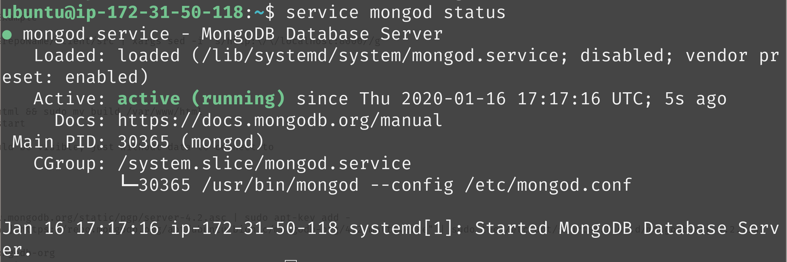
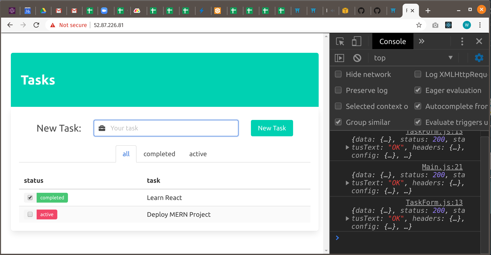
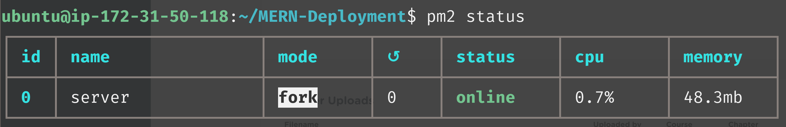

# MERN Deployment with AWS
### Table of Contents

1. [Launch EC2 Instance](#section1)
2. [MERN Setup](#section2)
3. [Config](#section3)

***

## Launch EC2 Instance <a name="section1"></a>

### Set up your server instance on AWS

> 1. [ ] [Login to AWS](https://signin.aws.amazon.com/signin?redirect_uri=https%3A%2F%2Fconsole.aws.amazon.com%2Fec2%2Fv2%2Fhome%3Fstate%3DhashArgs%2523Instances%253Asort%253DinstanceId%26isauthcode%3Dtrue&client_id=arn%3Aaws%3Aiam%3A%3A015428540659%3Auser%2Fec2&forceMobileApp=0&code_challenge=2NOh6S4ks7AdP04QdehoAt3ehxpWm4gvRmfaOb2dCSg&code_challenge_method=SHA-256) and search EC2 to get to your instances.Go to your running instances and select __Launch Instance__.  
>
>

> 2. [ ] Name your instance after your project.  
>
>

> 3. [ ] Select the image we want on our instance. This is the operating system that will be installed on our virtual machine. We want __Ubuntu__ at the __highest version__ that's still __Free tier eligible__. Just make sure you always pick __Free tier eligible__ if you don't want to end up paying Amazon fees!  
>
>

> 4. [ ] Select our instance type. __t2.micro__ is the largest instance that is still __Free tier eligible__. Again, we want to pick the smallest server possible, so we don't get charged.  
>
>

> 5. [ ] Configure your key pair. This will allow you to connect to your instance as an admin. This key cannot be shared. Never upload your PEM key to a git repo or put it on a public place on the internet. This is a literal key to access our instance. Misplacing it, can potentially allow bad actors to install malicious software. __Always store your PEM keys in a safe local folder!__  
> 
>     Name your key pair, ideally after your project, set the types to __RSA__ and __.pem__.  
>
>

> 6. [ ] Configure your security group. We want to limit the number of computers that can access our server through SSH, so it is recommended you set your SSH traffic to __My IP__. _If you are on public wifi or you change locations regularly, your IP address will change. If you are having trouble using SSH, confirm this IP address is yours!_  
>
>     We also want to enable all HTTPS and HTTP traffic. This is a server after all!  
>
>

> 7. [ ] Configure your storage. We want to make sure we stay in __Free tier eligible__.  
>
>

> 8. [ ] You should be able to launch your instance and return to your dashboard now.
> 
>     Select your instance and hit the __"Connect"__ button. The commands in the window that pops up should allow you to SSH (secure shell) your way onto the server.  
>
>     In your terminal, cd into the directory that contains you pem key. Once there, run the commands from the __"SSH client"__ tab on the EC2 dashboard _(The first command will properly set the permissions for a key name keyname.pem. The second will SSH into your AWS server instance. The following commands are an example. Be sure to copy the ones provided in your browser for proper functionality)_:  
> ```
> chmod 400 keyname.pem
> ssh -i "keyname.pem" ubuntu@ec2-XXX-XXX-XXX-XXX.compute-1.amazonaws.com
> ```
>
> - __Note__ : In Windows CMD you do not need to run the chmod command.  
>
>   You should now be connected to your server instance.  

> 9. [ ] Finally, run these two commands to make sure that our system is up to date:
> ```
> sudo apt-get update
> sudo apt-get -y upgradecopy  
> ```
>
> - If you see a pink screen to update __menu.lst__, choose the default option to __keep the local version currently installed__.  
***

## MERN Setup <a name="section2"></a>

### Push Your Code to GitHub

> 1. [ ] We need to get our project onto GitHub. Change directory `cd` into the folder that contains our `client/` and  `server/` folders.
> ```
> ├─ project-name/
> | ├─ client/
> | | ├─ node_modules/
> | | ├─ public/
> | | ├─ src/
> | | ├─ package.json
> | ├─ server/
> | | ├─ config/
> | | ├─ controllers/
> | | ├─ node_modules/
> | | ├─ models/
> | | ├─ routes/
> | | ├─ package.json
> | | ├─ server.js
> ```
>

> 2. [ ] Inside of this project-name folder, we will be making a file called `.gitignore`. The `.gitignore` file will allow us to tell git which files and folders we don't want it to track or commit. As the contents of our node_modules folders are rather large and can easily be re-downloaded we will be making sure these don't get pushed to GitHub.
> ```
> echo node_modules/ > .gitignore
> ```
>
> - This command will create a file called `.gitignore` and make its contents the text `node_modules/`.

> 3. [ ] Next, we will need to remove any git repositories that already exist inside of our client folder. When we run the `npx create-react-app` client command, Create React App will add in a git repository by default and as we wish to push all of our project to github as one repository we will need to remove this now. While we're inside of our client folder, we also want to create a production build of our code (basically transcode all that fancy JSX into vanilla HTML, CSS, and JS) that our user's computer will be able to understand.
>
>     ***IMPORTANT:*** *don't forget to `npm run build` before we push our code to GitHub.*
>
> ```
> cd client
> npm run build
> ```
>
> - MacOS and Git BASH
>
> ```
> rm -rf .git
> rm .gitignore
> ```
>
> - Windows CMD
>
> ```
> rmdir /s .git
> del /f .gitignore
> ```

> 4. [ ] Next we will initialize a git repository, add all of our code to it (ignoring node_modules) and create a commit with the message "Initial commit".
> ```
> cd ..
> git init
> git add .
> git commit -m "Initial commit"
> ```

> 5. [ ] Next we need to create a GitHub repository. After logging into GitHub, click on the repositories tab followed by the green button that says "New".
>
>

> 6. [ ] Next type in a name for your new repository "MERN-Deployment" works well and click on the "Create repository" button.
>
>

> 7. [ ] Then we will set the remote origin and push our code to it.
>
>
> <br><br>
> ```
> git remote add origin https://github.com/your_github_username/MERN-Deployment.git
> git push -u origin master
> ```

> Your Project should now be on GitHub. Yay!

## Config <a name="section3"></a>

### Getting our code onto the server instance

> 1. [ ] Now that we can SSH into our instance, we can install the software needed to run a MERN app. __From your SSH terminal, let's start running some commands.__
>
> ```
> sudo apt update
> sudo apt install nodejs npm nginx git -y
> ```
>
> - These commands will make sure the server has up to date software, then install: Node.js, Node Package Manager, NGINX (pronounced "engine x"), and git. The "-y" answers yes to the prompt of if you want to install all of this software.

### Node Version

> 1. [ ] By default, we will be getting version 8.10.0 when we install nodejs, and we need to get a more recent version for many of our packages to run happily on the server. To overcome this we will install a __PPA__ (personal package archive) that will allow us to get a newer version of nodejs.
>
> ```
>nodejs -v
> # this should print out version 10.19.0
> ```
>
> ```
> curl -sL https://deb.nodesource.com/setup_lts.x -o nodesource_setup.sh
> sudo bash nodesource_setup.sh
> sudo apt install nodejs -y
> node -v
> # this should now print out version 14.7.0 or newer
> ```
>
> ```
> sudo apt install build-essential
> ```

> 2. [ ] Now that we have installed NGINX (our server software), we should be able to navigate our browser to our server's public ip address and see the default NGINX splash screen.
>
>     ***IMPORTANT:*** *If you do not see the "Welcome to nginx!" message you either did not install NGINX in the previous step or you did not set up your Security Group correctly.*<br/><br/>
>       

> 3. [ ] Now that we have installed git, we can use it to clone our repository that we made in the first step.
> 
> ```
> git clone https://github.com/your_github_username/MERN-Deployment.git
> ```

> 4. [ ] Next (to make the following commands more copy-pasta-able) we will export a variable on our server.
> ```
> export repoName=MERN-Deployment
> ```

> 5. [ ] After exporting the variable, we can check to make sure it was set by echoing it. Echo will print the variable out in our terminal.
> 
> ```
> echo $repoName
> ```
> - When referring to our variable "repoName" moving forward we will have a "$" at the beginning of it.

### Setting up the Front-End

> 1. [ ] Next we'll cd into the client folder and then delete a folder at /var/www/html. This is where the html from the earlier "Welcome to nginx!" splash screen lives. We are then going to move the production react app code that we built before pushing the code to GitHub to this folder. Lastly we'll restart the nginx service so that it no longer serves the previous welcome message. 
>
> ```
> cd ~/$repoName/client
> sudo rm -rf /var/www/html 
> sudo mv build /var/www/html
> sudo service nginx restart
> ```
> - If we navigate our browser to our IP address we should see the Front-End of our project rather than the default NGINX splash screen. If you don't see this go back and try rerunning the previous steps. <br/><br/>
>
>   

> 2. [ ] __Fixing our Front-End routes__: when we were developing before, our Back-End server was accessible on `http://localhost:8000` but when we deploy our project the Back-End will then be accessible at whatever our IP address happens to be. To fix the links we would essentially need to go into our build folder and change all routes that look like this into routes that just start with `/`. While we could fire up vim and do just that we can instead use the power of BASH commands to make this change in one command.
> 
> ```
> sudo grep -rl localhost /var/www/html | xargs sed -i 's/http:\/\/localhost:8000//g'
> ```
>
> - This command will use grep (Global Regular Expression Print) to find all lines that contain the string "localhost" and pipe them into sed (Stream Editor) which will do a find and replace to remove the matching string.

### Setting up the Back-End

> 1. [ ] Next we need to retrieve the node_modules that we previously gitignored.
> 
> ```
> cd ~/$repoName/server
> npm i
> ```
>

> 2. [ ] Next we need to get our Back-End server working. __First thing we'll need is a working MongoDB.__
>
> - __Note__ : some of these commands are very long, so each new command is prefaced by a "$".
> ```
> wget -qO - https://www.mongodb.org/static/pgp/server-4.2.asc | sudo apt-key add -
> echo "deb [ arch=amd64 ] https://repo.mongodb.org/apt/ubuntu bionic/mongodb-org/4.2 multiverse" | sudo tee /etc/apt/sources.list.d/mongodb-org-4.2.list
> sudo apt update
> sudo apt install -y mongodb-org
> sudo service mongod start
> service mongod status
> ```
>
> - These commands will install MongoDB, start the MongoDB daemon, and display that daemon's status. You should see a message that looks like the following letting you know it's working.
>
> 

> 3. [ ] __Next we'll Configure NGINX.__ The following commands will delete the old NGINX configuration and open the file in vim for us to copy in our new configuration.
> 
> ```
> sudo rm /etc/nginx/sites-available/default
> sudo vim /etc/nginx/sites-available/default
> ```
>

> 4. [ ] Once inside vim use `i` to go into insert mode and paste in the following...
> 
> ```
> # MERN-Deployment Configuration 1-16-2020
> server {
>    listen 80 default_server;
>    listen [::]:80 default_server;
>    root /var/www/html;
>    index index.html index.htm index.nginx-debian.html;
>    server_name MERN-Deployment;
>    location /api {
>        proxy_pass http://localhost:8000;
>        proxy_http_version 1.1;
>        proxy_set_header Upgrade $http_upgrade;
>        proxy_set_header Connection 'upgrade';
>        proxy_set_header Host $host;
>        proxy_cache_bypass $http_upgrade;
>    }
>    location / {
>        try_files $uri $uri/ =404;
>    }
>    error_page 404 /index.html;
>}
> ```
>
> - After pasting in this configuration you can escape vim by using `esc` followed by `:wq` and then `enter`.
>
> - This configuration will point all requests that start with `/api` to our Back-End and will > respond to every other request with our `index.html` file.
>
>     ***IMPORTANT:*** *If your back-end server runs on a port other than 8000 change the configuration file above to use that port.*

> 5. [ ] Now that we have set up the configuration we can test to see if the Back-End is now connecting.
> - __Note__ : some of these commands are very long, so each new command is prefaced by a "$".
> ```
> cd ~/$repoName/server
> sudo service nginx restart
> node server.js
> ```
>
> - At this point our project should be working as long as the `node server.js` command is running.
>
> 

### Wrapping up

> 1. [ ] Our project is working, but as soon as we disconnect from the server instance our project will stop running. What we need is a process manager to keep our Back-End running. Enter pm2 (not surprisingly pm2 stands for __Process Manager 2__).
> - __Note__ : some of these commands are very long, so each new command is prefaced by a "$".
> ```
> sudo npm i pm2 -g
> pm2 start server.js
> pm2 status
> ```
>
> - These commands will install pm2 globally, tell pm2 to run `server.js` for us, and display the status of pm2.
>
> 
>
> - At this point if the status says "online" you are now finished deploying. Good job!

### Updating your code and refreshing your installation

> If you find a bug and want to fix it...or just add some fun extras so you can show this off to friends, do the following:
> 1. Update your code and test it on your local computer.
> 2. Stage and commit your code to your git repository using the command line or your VSCode editor's tools
> 3. Push the changes up to github: `git push`
>
> Connect via SSH to your instance as described above:
> 1. Change directory in to your project folder: `cd ~/MERN-Deployment`
> 2. Stop the PM2 process daemon: `pm2 stop all`
>    - This should stop the express/node server
> 3. Pull the recent changes from github using: `git pull`
> 4. Change directory in to the client folder: `cd client`
> 5. Rebuild the React App: `npm run build`
> 6. Stop the currently running nginx process:  
>    1. `sudo service nginx stop`
>    2. `sudo service nginx status` <-- verify that it is "inactive"
> 7. Replace the running React App and remember to update the URLs using grep and sed:
>    1. `sudo rm -rf /var/www/html`
>    2. `sudo mv build /var/www/html`
>    3. `sudo grep -rl localhost /var/www/html | xargs sed -i 's/http:\/\/localhost:8000//g'`
> 8. Restart the PM2 process: `pm2 restart all`
>    - This should restart your express/node server
> 9. Restart the React app
>    1. `sudo service nginx restart`
>    2. `sudo service nginx status`  <-- verify that it is "active (running)"
>
> To view the server logs while using PM2, run the following command:
> ```
> sudo pm2 logscopy
> ```
>
> To exit viewing the logs use: 
> ```
> CTRL + c
> ```